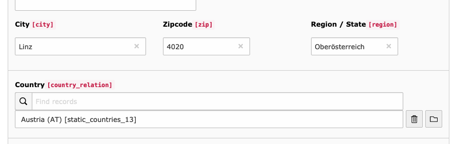

# TYPO3 Extension `ttaddress_country_relation`

This TYPO3 extensions adds a new field to `tt_address` to allow a relation to the country field of `EXT:static_info_tables`.



## Usage

1) Install this extension by using `composer require studiomitte/ttaddress-country-relation` or by installing it in the Extension Manager
2) Select a country in a address record.
3) Adopt the templates and use e.g. `{address.countryRelation.shortNameLocal}`. 

### Hide previous field

Hide the country or region text field by using Page TsConfig.

```
TCEFORM.tt_address {
    country.disabled = 1
    region.disabled = 1
}
```

## Migration

A basic migration script updates the relation field by checking the country field and compare it to the following fields of `static_countries`: cn_short_local, cn_short_en, cn_official_name_en, cn_iso_2, cn_iso_3

Call the script with

```bash
./typo3cms ttaddress_country_relation:migrate
```

## Credits

This extension was created by Georg Ringer for [Studio Mitte, Linz](https://studiomitte.com) with ♥.

[Find more TYPO3 extensions we have developed](https://www.studiomitte.com/loesungen/typo3) that provide additional features for TYPO3 sites. 

